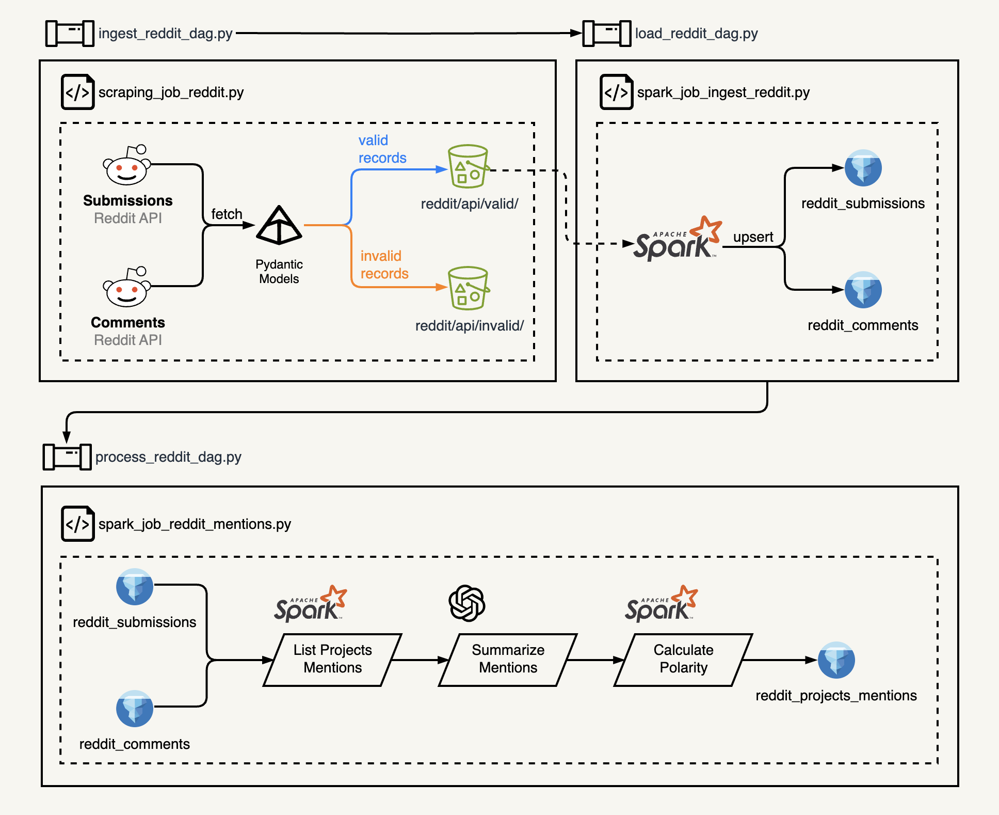
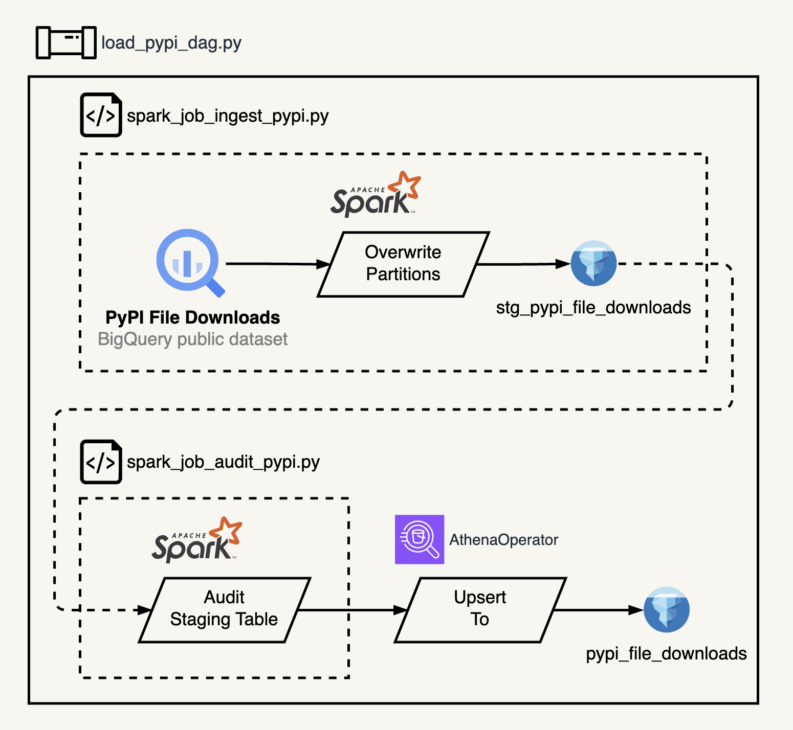
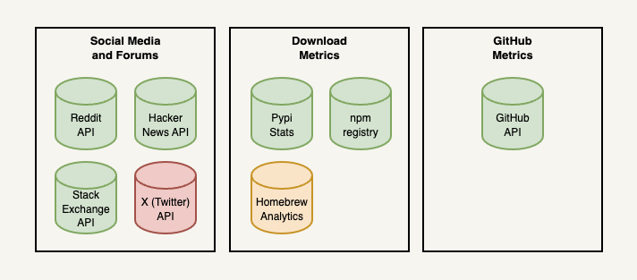

# MAD Dashboard
### `M`achine Learning, `A`nalytics, and `D`ata `Dashboard`

Inspired by [Matt Turck](https://www.linkedin.com/in/turck/)'s [MAD Landscape](https://mattturck.com/mad2023/) initiative to help data practitioners navigate and make sense of the rapidly evolving world of data products and frameworks, the **MAD Dashboard** aims at giving a birds-eye-view of the scene with insights about popularity and adoption of these tools.

With the project, my goal is to help answering questions such as:
> - What is the most popular Open Source OLAP Database?
> - Which NoSQL Database is experiencing the fastest adoption rate?
> - Which file formats are increasing in adoption? Which are decreasing?
> - What was the most popular MLOps framework 3 years ago? What is the most popular today?

And hopefully much more.

# Architecture

The current architecture leverages public datasets and APIs for the Python Package Index (PyPI) and Reddit Submissions and Comments.

The main components are:
- **Apache Airflow**: Orchestration of scraping and ETL pipelines with Astronomer CLI for local development and Astronomer Cloud for deployment.
- **Apache Iceberg**: Open Table Format for the Lakehouse Architecture.
- **AWS Glue**: Serverless data integration service for PySpark jobs.
- **AWS Glue Catalog**: Data Catalog.
- **AWS Athena**: Serverless analytical SQL query engine to interact with the Iceberg Lakehouse.

# Data Pipelines
## Reddit
The Reddit Pipeline handles a daily update to three production tables:
- reddit_submissions
- reddit_comments
- reddit_projects_mentions

### `ingest_reddit_dag`
A daily job retrieves the top 100 new submissiosn from the tracked subreddits. For all retrieved submissions, it crawls through its comments tree to retrieve all comments. The results are saved to a daily store in S3.

Data quality is ensured at extraction from the Reddit API. Pydantic Models are used to validate data types are as expected, and that important fields are not missing from the API response.

A dedicated storage captures invalid records, that are also logged in S3 via `S3LogHandler` defined at `include/utils/log_config.py`.

> [!NOTE]  
> Due to the nature of the new Reddit API, this dag **is not idempotent** and **cannot** be used for backfills, as the data retrieved is always bound to the execution time (top 100 recent submissions).

### `load_reddit_dag`
Validated data is loaded to iceberg table. This job performs an upsert, merging submissions and comments directly in the production table.

Any existing comment or submission from a previous retrieval is updated with their recent stats (upvotes, comments, gildings, etc.), if captured in the current update.

This pipeline will also archive processed reddit raw records.

This pipeline is idempotent and can be used for backfills from archived records.

## PyPI
The PyPI pipeline is an **Write, Audit, Publish** pattern that handles daily updates to the `pypi_file_downloads` production table.

### `load_pypi_dag`
This main dag implements an **Write, Audit, Publish** pattern performing the tasks:
- create_staging_table_if_not_exists
- ingest_to_staging_table
- is_latest_dag_run
- audit_staging_table
- create_production_table_if_not_exists
- exchange_step
- cleanup_step

The ingest task fetches daily aggregates of pypi projects downloads for the [tracked projects](#tracked-projects). It currently processes daily an estimate of 500 GB of data from the source BigQuery dataset, and loads them into iceberg tables.

The current record count of daily aggregates with backfilled data from 2024-01-01 to 2024-06-29 is of 50.5 M records.

### `process_reddit_dag`
Reddit Submissions and Comments are processed to extract mentions for the [tracked projects](#tracked-projects). After mentions are extracted, they are summarized (with OpenAI gpt-3.5-turbo) and returned as a json record (with format integrity ensured by the guidance framework).

Data is stored at the production table `reddit_projects_mentions`.

This pipeline is idempotent (with a caveat on the dependency on the OpenAI ChatGPT API) and can be backfilled.

# Conceptual Data Modeling

The core reference dataset for this dashboard is sourced from the [2023 MAD Landscape]((https://mattturck.com/mad2023/)) by Matt Turck. Matt's analysis for 2023, however, is comprised of more than 1,400 logos and for a couple of reasons that list need to be trimmed down to a more manageable number of products/frameworks to be tracked.

A curated subset will, therefore, be manually selected from his [interactive dashboard](https://mad.firstmark.com/). This initial selection will be partially arbitrary, but the idea is to implement a scalable and extensible solution, where new products can be onboarded in the future.

To compose the metrics and datasets for analytics, data will be collected from data sources from three major categories:

- Social Media and Forums
- Download Metrics
- GitHub Metrics

A short description of each dataset and an explanation of the color scheme is included below.

## Data Sources
### Social Media and Forums
This section will track daily (and possibly near-real-time) mentions of the selected data tools and frameworks.

**[Reddit API](https://www.reddit.com/dev/api/)**: Will be used to track daily mentions at the most relevant subreddits in the data community:
  - `r/dataengineering` (183k members)
  - `r/machinelearning` (2.9M members)
  - `r/datascience` (1.6M members)
  - `r/analytics` (163k members)
  - `r/localllama` (162k members)
  - `r/learnprogramming` (4.1M members)

The reddit API has gone through substantial policies changes in 2023 and the endpoints no longer reach the complete history of the posts in the platform. For this reason, historical data for an initial load and backfills up to December 2022 will be retrieved from [The Reddit Community Archive](https://the-eye.eu/redarcs/) by Pushshift.io and The-Eye.eu.

**[StackExchange API](https://api.stackexchange.com/docs)**: Will be used to track daily questions posted on StackOverflow. A public [BigQuery dataset](https://bigquery.cloud.google.com/dataset/bigquery-public-data:stackoverflow) is available for historical data up until September 2022.
> [!NOTE]
> Dataset to be included.

**[Hacker News API](https://github.com/HackerNews/API)**: Will be used to track daily mentions at the Y Combinator Hacker News forum.
> [!NOTE]
> Dataset to be included.

**[X(Twitter) API v2](https://developer.x.com/en/docs/twitter-api)**: The X(Twitter) API is marked red as its Free and Basic tiers have very limited rates to fetch Twitter posts. The nature of the platform also makes it difficult to openly track mentions of products and tools without a brute force search through all posts daily.

### Download Metrics
This section will track daily download metrics of the selected data tools and frameworks. The main caveat from this section is the lack of coverage of proprietary tools that require dedicated installers.

**[pypi metrics](https://console.cloud.google.com/bigquery?ws=!1m4!1m3!3m2!1sbigquery-public-data!2spypi)**: Public dataset of the Python Package Index downloads metrics. This is dataset contains download events of PyPI packages and currently spans 917 billion rows with 323TB.

**[npm registry](https://github.com/npm/registry/blob/main/docs/download-counts.md#per-version-download-counts)**: The npm registry is a publicly available dataset of daily snapshots of npm's log data.

**[Homebrew Formulae](https://formulae.brew.sh/analytics/)**: Homebrew's public available analytics data of install events. This dataset is orange because the data is publicly available only via an aggregated count of events for the past 30, 90, and 365 days.

### GitHub Metrics
**[GitHub API](https://docs.github.com/en/rest/quickstart)**: The GitHub APIs will be used to track numbers from the repositories associated with the list of products and frameworks listed in the dashboard. This might include:
- Star count
- Contributors count
- Open issues
- Open discussions

## Tracked Projects
### Warehouse / Lakehouse
- Databricks
- Snowflake
- BigQuery
- Starburst
- dremio

### Analytics Engine
- Spark
- Trino
- Presto
- Pinot

### Formats
- Delta Lake (pypi: deltalake)
- Iceberg (pypi: pyiceberg)
- Hudi
- parquet
- avro (pypi: avro)
- arrow (pypi: pyarrow)
- orc (pypi: pyorc)
- thrift (pypi: thrift)
- protobuf (pypi: protobuf)

### Streaming
- Kafka (pypi: kafka)
- Flink (pypi: apache-flink)
- Confluent (pypi: confluent-kafka)
- Redpanda
- Striim

### Databases
- Postgres (pypi: psycopg2)
- MySQL (pypi: mysql-connector-python)
- SQLServer
- DynamoDB
- CosmosDB
- MongoDB (pypi: pymongo)
- ScyllaDB
- Druid (pypi: pydruid)
- Couchbase (pypi: couchbase)
- CockroachDB
- MariaDB
- Cassandra
- ClickHouse (pypi: clickhouse-connect)
- redis (pypi: redis)
- Neo4j (pypi: neo4j)
- Pinecone (pypi: pinecone)
- Weaviate (pypi: weaviate-client)
- Qdrant (pypi: qdrant-client)
- chroma (pypi: chromadb)
- DuckDB (pypi: duckdb)
- SQLite (included in Python since 2.5)

### ETL/ELT
- dbt (pypi: dbt-core)
- Fivetran
- Airbyte (pypi: airbyte)
- Azure Data Factory
- AWS Glue
- Meltano (pypi: meltano)

### Orchestration
- Airflow (pypi: apache-airflow)
- Astronomer
- Dagster (pypi: dagster)
- Prefect (pypi: prefect)
- Mage (pypi: mage-ai)

### Data Quality
- Collibra
- Monte Carlo
- Soda

### Machine Learning
- PyTorch (pypi: torch)
- Tensorflow (pypi: tensorflow)
- Keras (pypi: keras)
- XGBoost (pypi: xgboost)
- LightGBM (pypi: lightgbm)
- Scikit-Learn (pypi: scikit-learn)
- Vertex AI
- Sagemaker
- Azure Machine Learning (aliases: Azure ML)
- mlflow (pypi: mlflow)
- optuna (pypi: optuna)
- Weights and Biases (aliases: w&b, Weights & Biases | pypi: wandb)
- dvc (pypi: dvc)
- Neptune (aliases: neptune.ai | pypi: neptune)

### Generative AI
- LangChain (pypi: langchain)
- LlamaIndex (pypi: llama-index)
- LiteLLM (pypi: litellm)
- guidance (pypi: guidance)
- DSPy (pypi: dspy-ai)
- LMQL (pypi: lmql)
- Haystack (pypi: haystack-ai)
- Ollama (pypi: ollama)
- llamacpp
- OpenLLM (pypi: openllm)

